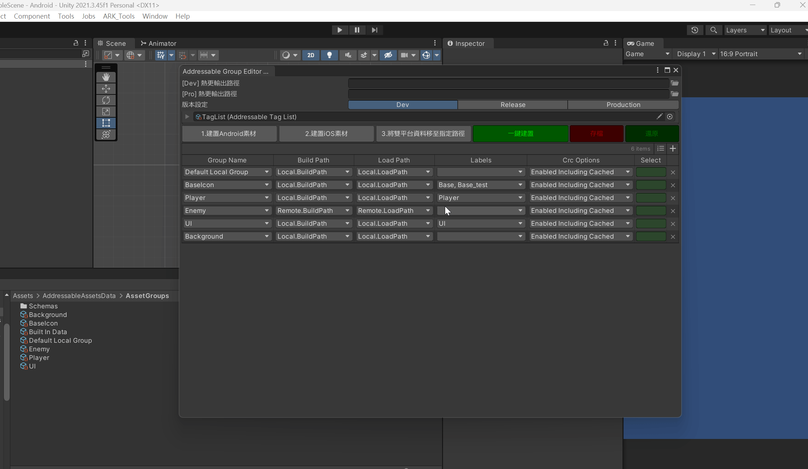
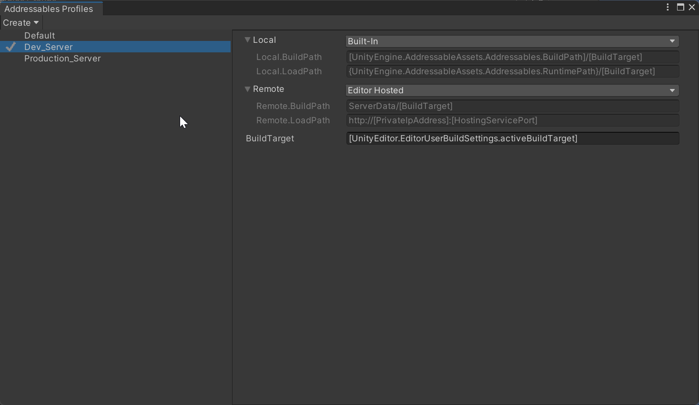

## 環境需求

[Odin Inspector](https://assetstore.unity.com/packages/tools/utilities/odin-inspector-and-serializer-89041)  (內容不包含 Odin，需自行安裝)  
Unity 2021.3.45f1  

---

## AddressableGroupEditorWindow

**使用情境:**  
輔助AddressableGroup使用，批量檢查Group的CRC、Label、BuildPath是否設定錯誤  
支援直接修改，修改玩值後會以紅色框標示，方便確認修改哪些資訊，也可以還原修改。

## Extra:  

上方版本設定Dev/Release/Production配合底下的 建置Android/IOS  
可以處理切換Profile，並且建置指定平台的素材，已經假定有兩種Profile，分別為Dev/Production

雙平台素材遷移則是建置完後，將兩個版本的兩個平台素材搬移到指定的資料夾底下，方便上傳為後端用的素材。  

一鍵建置是123步驟都執行一次

---

Asset by Goldmetal Studio

